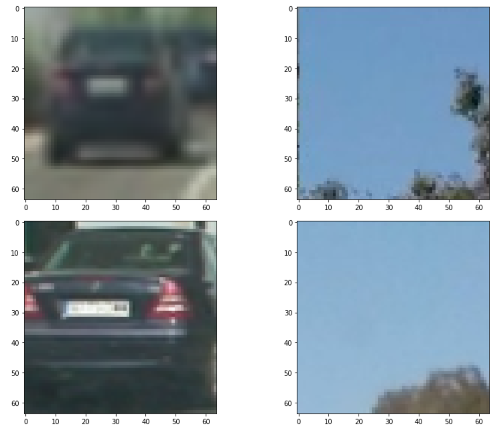
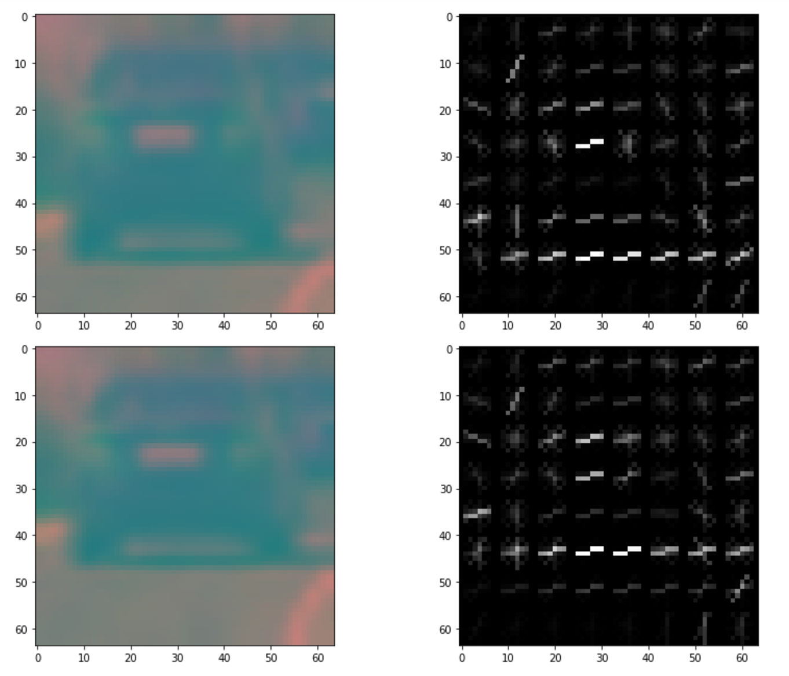
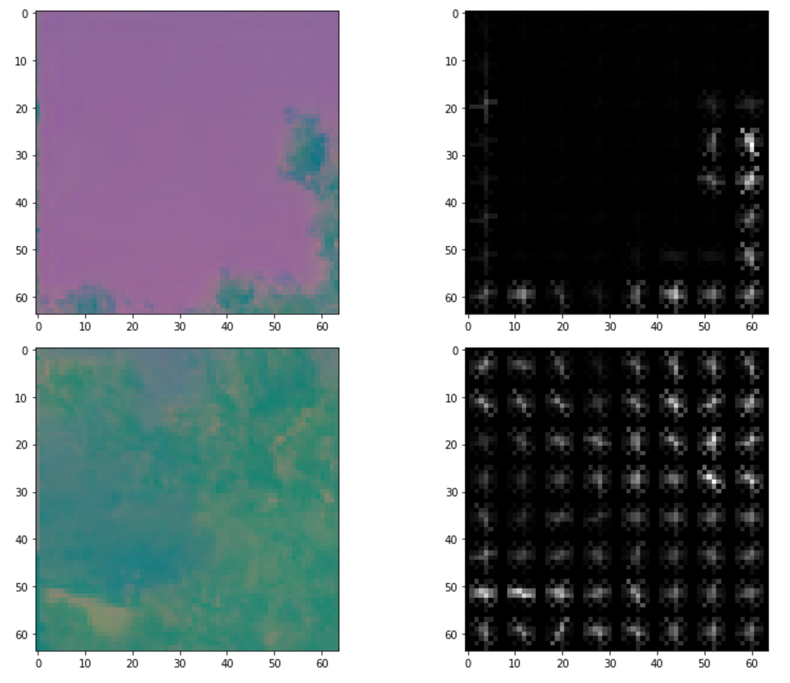
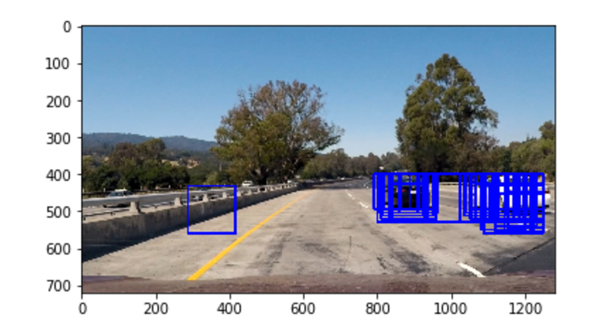
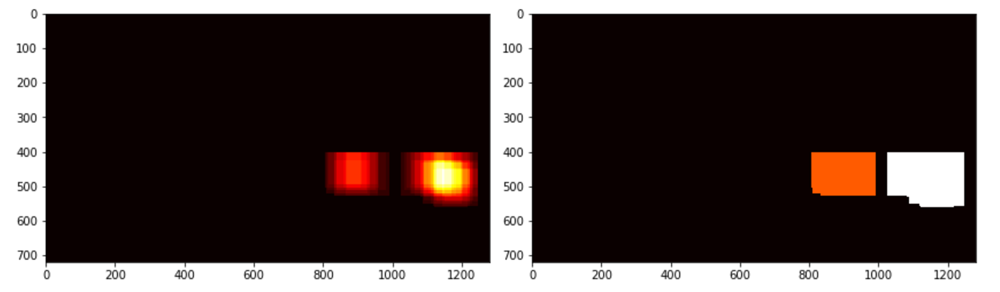
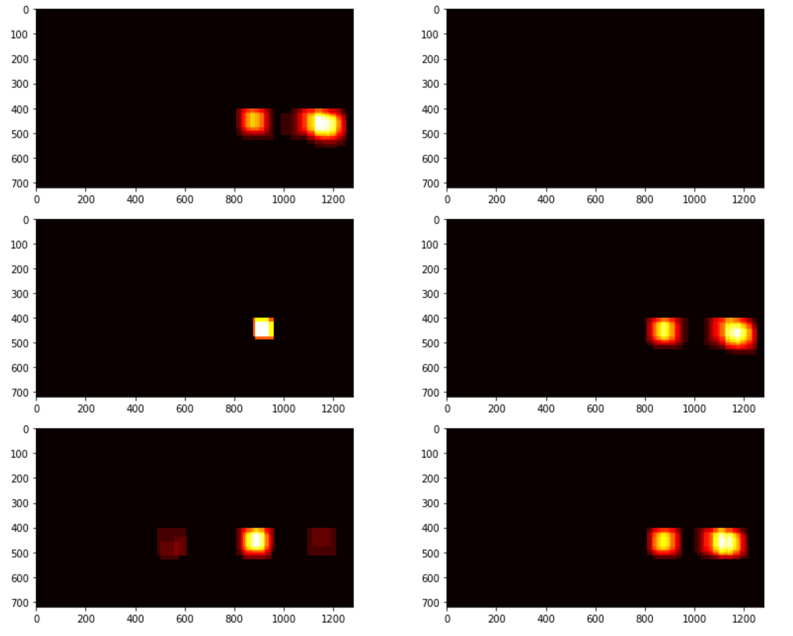
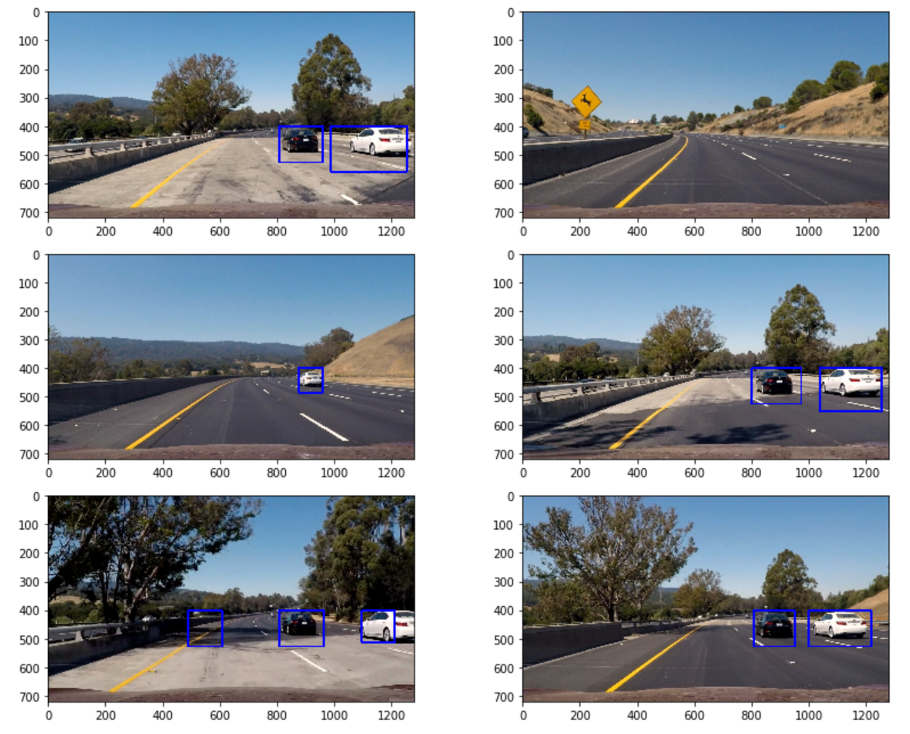

##Writeup Template
###You can use this file as a template for your writeup if you want to submit it as a markdown file, but feel free to use some other method and submit a pdf if you prefer.

---

**Vehicle Detection Project**

The goals / steps of this project are the following:

* Perform a Histogram of Oriented Gradients (HOG) feature extraction on a labeled training set of images and train a classifier Linear SVM classifier
* Optionally, you can also apply a color transform and append binned color features, as well as histograms of color, to your HOG feature vector.
* Note: for those first two steps don't forget to normalize your features and randomize a selection for training and testing.
* Implement a sliding-window technique and use your trained classifier to search for vehicles in images.
* Run your pipeline on a video stream (start with the test_video.mp4 and later implement on full project_video.mp4) and create a heat map of recurring detections frame by frame to reject outliers and follow detected vehicles.
* Estimate a bounding box for vehicles detected.

[//]: # (Image References)
[image1]: ./examples/car_not_car.png
[image2]: ./examples/HOG_example.jpg
[image3]: ./examples/sliding_windows.jpg
[image4]: ./examples/sliding_window.jpg
[image5]: ./examples/bboxes_and_heat.png
[image6]: ./examples/labels_map.png
[image7]: ./examples/output_bboxes.png
[video1]: ./project_video.mp4

## [Rubric](https://review.udacity.com/#!/rubrics/513/view) Points
###Here I will consider the rubric points individually and describe how I addressed each point in my implementation.  

---

###Histogram of Oriented Gradients (HOG)

####1. Explain how (and identify where in your code) you extracted HOG features from the training images.

The feature extraction functions are contained from code block 7-18 in the jupyter notebook.

I started by reading in all the `vehicle` and `non-vehicle` images.  Here is an example of two of each of the `vehicle` and `non-vehicle` classes:



I then explored different color spaces and different `skimage.hog()` parameters (`orientations`, `pixels_per_cell`, and `cells_per_block`).  I grabbed random images from each of the two classes and displayed them to get a feel for what the `skimage.hog()` output looks like.

I used the following parameters while extracting the HOG features:

```
color_space = 'YCrCb'
orient = 9
pix_per_cell = 8
cell_per_block = 2
hog_channel = 'ALL'
```

Here is a visualization of the HOG features transformed from one channel in YCrCb color space of cars and notcars:

Cars:


Not Cars:


From these visualizations we can see that the HOG features for cars and not cars are very different. HOG features for cars seems to have a similar pattern.

####2. Explain how you settled on your final choice of HOG parameters.

I mainly try different orient (6, 12) because it seems like it affect the runtime the most. Eventually I found that 9 orient gives the best accuracy in training while not increasing the training time too much.

Also, I tried RGB color space. The YCrCb gives a better validation accuracy.

####3. Describe how (and identify where in your code) you trained a classifier using your selected HOG features (and color features if you used them).

The code for training the linear SVM is contained in code block 13-17. I trained a linear SVM using the spatial features, histogram of the original image and the HOG features.

The features are extracted using the following parameters:
```
color_space = 'YCrCb'
orient = 9
pix_per_cell = 8
cell_per_block = 2
hog_channel = 'ALL'
spatial_size = (16,16)
hist_bins = 16
```
###Sliding Window Search

####1. Describe how (and identify where in your code) you implemented a sliding window search.  How did you decide what scales to search and how much to overlap windows?

I used a sliding window with size 64x64 and 2 pixels per step. The scales I used was within a range from 1.2 to 2 that are equally divided into 5 steps.

I manually tried several different scales from 1 to 3 and found that the scales from 1.2 to 2 are the most effective in finding the related boxes.

####2. Show some examples of test images to demonstrate how your pipeline is working.  What did you do to optimize the performance of your classifier?

Ultimately I searched on 5 scales using YCrCb 3-channel HOG features plus spatially binned color and histograms of color in the feature vector, which provided a nice result.  Here is an example image:


---

### Video Implementation

####1. Provide a link to your final video output.  Your pipeline should perform reasonably well on the entire project video (somewhat wobbly or unstable bounding boxes are ok as long as you are identifying the vehicles most of the time with minimal false positives.)
Here's a [link to my video result](./output3.mp4)


####2. Describe how (and identify where in your code) you implemented some kind of filter for false positives and some method for combining overlapping bounding boxes.

I recorded the positions of positive detections in each frame of the video.  From the positive detections I created a heatmap and then thresholded that map to identify vehicle positions.  I then used `scipy.ndimage.measurements.label()` to identify individual blobs in the heatmap.  I then assumed each blob corresponded to a vehicle.  I constructed bounding boxes to cover the area of each blob detected.  

Here is a frame of test images with false positives and its heatmap.




From the above heatmap and label images we can see that with thresholding, we successfully get rid of the false positive boxes and only have kept the ones with the cars. The the bounding boxes are drawn using the labels.

Here are the heatmaps for six testing images and their final bounding boxes:



We can see that on the lower left image there is a false positive detected. Somehow the shades of a tree is classified as a car. This is probably due to the fact that there isn't enough training data of the shade of a tree.

---

###Discussion

####1. Briefly discuss any problems / issues you faced in your implementation of this project.  Where will your pipeline likely fail?  What could you do to make it more robust?

There are still some false positives under the tree shadings. One of the possible way to correct this is to add some tree shading images to the training set in the not cars category and let the classifier better learned the pattern of tree shadings.

Also in the video we can see that the bounding boxes are not stable, they sometimes disappeared and it is not covering the entire car. One possible way to fix this is to better tune the scales and heatmap thresholding parameters. Also, it is probably a good idea to reused the heatmap found from the previous frames to try to stablize the bounding boxes and get rid of false positives.
